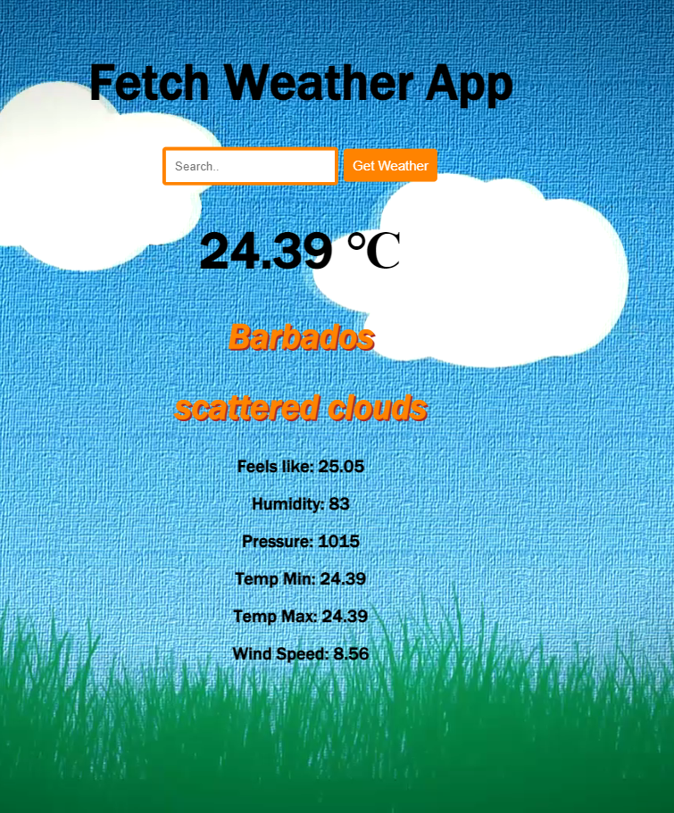

Weather App
-----------
*Using Fetch/json and Openweathermap Api to create a vanilla javascript weather app.
*Search box to enter a city to "get the weather"

Animated background
-------------------
Animated the background with a cool cartoon style video - see screenshot below.
The clouds loop in a random continual stream across the screen and instead of a real sky video, opted for a cartoon style blue sky, green grass background with floating, animated clouds streaming across the screen.

